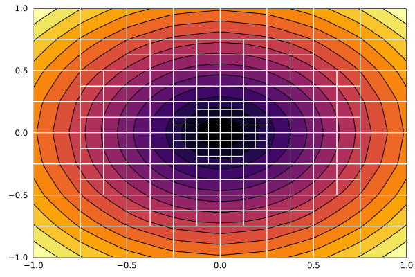
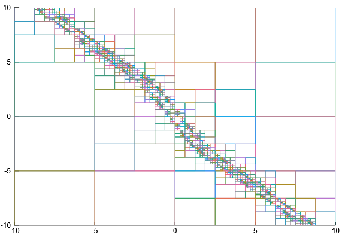

# RegionTrees.jl: Quadtrees, Octrees, and their N-Dimensional Cousins

This Julia package is a lightweight framework for defining N-Dimensional region trees.
In 2D, these are called *region quadtrees*, and in 3D they are typically referred to as *octrees*.
A region tree is a simple data structure used to describe some kind of spatial data with varying resolution.
Each element in the tree can be a leaf, representing an N-dimensional rectangle of space, or a node which is divided exactly in half along each axis into 2^N children.
In addition, each element in a `RegionTrees.jl` tree can carry an arbitrary data payload.
This makes it easy to use `RegionTrees` to approximate functions or describe other interesting spatial data.

## Features

* Lightweight code with few dependencies (only `StaticArrays.jl` and `Iterators.jl` are required)
* Optimized for speed and for few memory allocations
    * Liberal use of `@generated` functions lets us unroll most loops and prevent allocating temporary arrays
* Built-in support for general adaptive sampling techniques

## Usage

See the documentation for usage and examples:

* [Demo](@ref) page for a quick walkthrough or
* [Adaptive Distance Fields](@ref) page for a more complex example,
* [Adaptively Sampled Model Predictive Control](@ref) for an adaptive approximation of a model-predictive controller

These examples come from the notebooks in the `examples/` folder.
The original jupyter notebooks are kept for archival reason, but they 
f someone prefers to work with jupyter notebooks (please note, that the notebooks may not work out of the box).

You can also check out:

* [AdaptiveDistanceFields.jl](https://github.com/rdeits/AdaptiveDistanceFields.jl) for a more complete adaptively-sampled distance field example [1]
* [examples/adaptive_mpc/adaptive_mpc.ipynb](examples/adaptive_mpc/adaptive_mpc.ipynb) for an adaptive approximation of a model-predictive controller

[1] Frisken et al. "Adaptively Sampled Distance Fields: A General Representation of Shape for Computer Graphics". SIGGRAPH 2000.

## Gallery

An adaptively sampled distance field, from the documentation ([Examples/Adaptive Distance Fields]):

An adaptively sampled model-predictive control problem, from `examples/adaptive_mpc.ipynb`:

## Related Packages

* [Morton.jl](https://github.com/JaneliaSciComp/Morton.jl)
* [Interpolations.jl](https://github.com/JuliaMath/Interpolations.jl)
